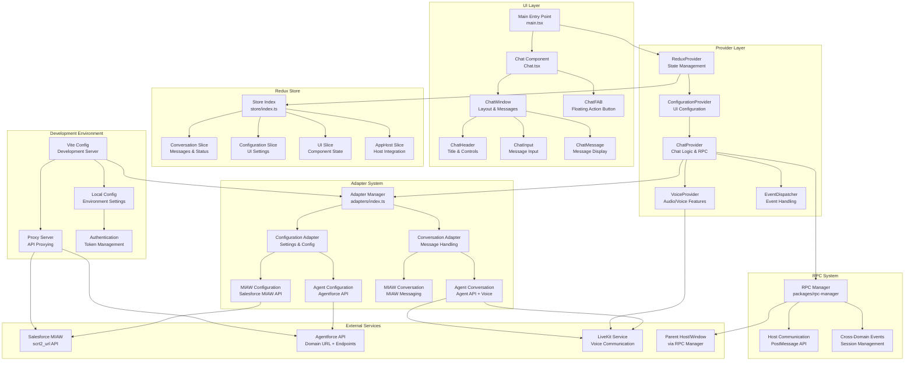

# Agentforce Messaging Repository Flow Documentation

A comprehensive guide to understanding the architecture, data flow, and component relationships in the Agentforce Messaging React application.

## 🏗️ Architecture Overview

The Agentforce Messaging application is a modern React-based chat solution that provides seamless integration with Salesforce's messaging infrastructure. It supports multiple backend adapters, voice communication, and flexible deployment options.

### Key Design Principles

- **Modular Architecture**: Clear separation between UI, state management, and service integration
- **Adapter Pattern**: Pluggable backends for different Salesforce messaging services
- **Provider System**: React Context-based dependency injection
- **Cross-Domain Communication**: RPC-based iframe integration
- **Configuration-Driven**: Runtime configuration for different environments

## 📊 System Architecture Diagram



## 🚀 Application Entry Points

### Production Entry Points
- **`src/main.tsx`**: Primary production entry point with `initReact()` function
- **`src/loader.ts`**: Simple loader that initializes the application

### Development Entry Points
- **`src/dev.tsx`**: Development mode with debugging features
- **`src/frameDev.tsx`**: iframe development mode
- **`src/frameHost.tsx`**: iframe host integration

### Entry Point Flow
```
Browser Load → Entry Point → initReact() → Provider Chain → Chat Component
```

## 🧩 Core Components

### UI Layer Components

| Component | Purpose | Key Features |
|-----------|---------|--------------|
| `Chat.tsx` | Main chat container | Layout mode detection, FAB/inline switching |
| `ChatWindow.tsx` | Conversation interface | Message list, scrolling, responsive design |
| `ChatFAB.tsx` | Floating action button | Minimizable chat interface |
| `ChatInput.tsx` | Message input | Text input, send button, typing indicators |
| `ChatMessage.tsx` | Individual messages | Agent/user messages, timestamps, formatting |
| `ChatHeader.tsx` | Chat header bar | Title, controls, status indicators |

### Provider System

| Provider | Responsibility | Key Features |
|----------|----------------|--------------|
| `ReduxProvider` | State management | Redux store, persistence, middleware |
| `ConfigurationProvider` | UI configuration | Theming, labels, feature flags |
| `ChatProvider` | Chat orchestration | Message handling, RPC, session management |
| `VoiceProvider` | Audio features | LiveKit integration, voice mode |
| `EventDispatcher` | Event broadcasting | Custom events, host communication |

## 🗄️ State Management (Redux)

### Store Structure

```
store/
├── index.ts              # Store configuration
├── slices/
│   ├── conversation.ts   # Messages, participants, status
│   ├── configuration.ts  # UI settings, labels
│   ├── ui.ts            # Component state, modals
│   └── apphost.ts       # Host integration
├── middleware/
│   ├── asyncDispatch.ts # Async action handling
│   └── conversationDataMiddleware.ts # Data sync
├── persistence.ts       # State persistence
└── sessionSync.ts       # Cross-tab synchronization
```

### Key State Slices

#### Conversation Slice
```typescript
interface ConversationState {
  conversationId: string | null;
  status: ConversationStatus;
  entries: ConversationEntry[];
  participants: Participant[];
  isVoiceMode: boolean;
  isLoading: boolean;
}
```

#### Configuration Slice
```typescript
interface ConfigurationState {
  labels: Record<string, string>;
  allowVoiceMode: boolean;
  theme: UIConfiguration;
}
```

## 🔌 Adapter System

The adapter pattern enables multiple backend integrations:

### Adapter Types

#### Configuration Adapter
```typescript
interface ConfigurationAdapter {
  adapterType: "configuration";
  getConversationId: () => string | undefined;
}
```

#### Conversation Adapter
```typescript
interface ConversationAdapter {
  adapterType: "conversation";
  startConversation: () => Promise<string>;
  endConversation: () => VoidPromise;
  sendMessage: (messageId: string, messageText: string) => Promise<unknown>;
  setIsTyping: (isTyping: boolean) => VoidPromise;
}
```

### Current Implementations

#### MIAW Adapter
- **Purpose**: Salesforce MIAW (Messaging in a Window) integration
- **API**: SCRT2 endpoints
- **Features**: Basic messaging, configuration
- **Files**: `src/adapters/miaw/`

#### Agent Adapter  
- **Purpose**: Agentforce API integration
- **API**: Agentforce domain endpoints
- **Features**: Advanced messaging, voice support, streaming
- **Files**: `src/adapters/agent/`

### Adapter Lifecycle

```
1. Configuration loads → 2. Adapter selected → 3. Factory creates instance → 
4. Registers with Redux → 5. Handles messages → 6. Cleanup on destroy
```

## 📡 Data Flow

### Message Send Flow

```
User Input → ChatInput → Redux Action → Middleware → Adapter → External API
                                                        ↓
UI Update ← Redux State ← Adapter Event ← API Response ←
```

### Message Receive Flow

```
External API → Adapter EventSource → Adapter Event → Redux Action → State Update → UI Render
```

### Configuration Flow

```
App Start → Local Config → Adapter Selection → Adapter Creation → Redux Registration → UI Ready
```

## 🎙️ Voice Integration

### LiveKit Integration

The application supports real-time voice communication through LiveKit:

```
Voice Mode → LiveKit Token → Room Connection → Audio Stream → Agent Integration
```

### Voice Components
- **`VoiceProvider.tsx`**: Voice state management
- **`ChatVoiceMode.tsx`**: Voice UI controls
- **`useAgentLiveKit.ts`**: LiveKit hook
- **`MicrophoneVisualization.tsx`**: Audio visualization

## 🌐 RPC Manager (Cross-Domain Communication)

### Purpose
Enables secure communication between iframe and parent window for embedded scenarios.

### Key Features
- **Bidirectional RPC**: Both host and client can call each other
- **Cross-domain messaging**: Uses `postMessage` API
- **Connection management**: Automatic connection detection
- **Error handling**: Configurable error handlers
- **Session management**: Handle session lifecycle

### Usage Patterns
```typescript
// Host side
rpcHost.registerHandler("connect", async (event) => {
  return { allowed: true };
});

// Client side  
const result = await rpcClient.callRemote("connect", { type: "chat" });
```

## ⚙️ Development Environment

### Vite Configuration

The development environment includes:

- **Hot Module Replacement (HMR)**: Instant updates during development
- **Proxy Server**: Routes API calls through development server
- **Token Management**: Automatic OAuth/Bootstrap token handling
- **HTTPS Support**: Production-like HTTPS testing
- **Multi-entry builds**: Support for iframe and standalone modes

### Local Configuration

Configuration is managed through `.local-config` files:

```yaml
adapter: "agent"  # or "miaw"
use_iframe: true
agent_api:
  agent_id: "your-agent-id"
  domain_url: "https://your-salesforce-domain.com"
  enable_streaming: true
proxy:
  enable: true
  token_auto_refresh: true
livekit:
  livekit_url: "wss://your-livekit-server.com"
```

## 🚀 Build & Deployment

### Build Targets

```bash
# Development
yarn dev                 # Start development server

# Production
yarn build              # Build for production
yarn build:app          # Build application only
yarn build:packages     # Build RPC manager package

# Testing
yarn test               # Run tests
yarn test:coverage      # Run with coverage
```

### Output Formats

- **ES Modules**: Modern bundlers
- **UMD**: Universal module definition
- **IIFE**: Browser globals
- **TypeScript Definitions**: Type support

## 📁 Project Structure

```
src/
├── components/         # React UI components
│   ├── Chat.tsx       # Main chat container
│   ├── ChatWindow.tsx # Conversation interface
│   └── ui/            # Reusable UI components
├── providers/         # React Context providers
├── store/             # Redux state management
│   ├── slices/        # Redux state slices
│   └── middleware/    # Custom middleware
├── adapters/          # Service integration layer
│   ├── agent/         # Agentforce adapter
│   ├── miaw/          # MIAW adapter
│   └── index.ts       # Adapter manager
├── hooks/             # Custom React hooks
├── utils/             # Utility functions
├── types/             # TypeScript definitions
└── @types/            # Global type definitions

packages/
└── rpc-manager/       # Cross-domain communication
    ├── rpc.ts         # Core RPC implementation
    └── examples/      # Usage examples

public/                # Static assets
dist/                  # Build output
```

## 🔧 Key Technologies

- **React 19**: UI framework with latest features
- **Redux Toolkit**: Predictable state management
- **TypeScript**: Type safety and developer experience
- **Vite**: Fast build tool and development server
- **Tailwind CSS**: Utility-first styling
- **Vitest**: Testing framework
- **LiveKit**: Real-time communication
- **PostMessage API**: Cross-domain communication

## 🔗 Integration Points

### Salesforce Integration
- **Bootstrap API**: Authentication and initialization
- **Agentforce API**: Agent messaging and configuration
- **MIAW API**: Salesforce messaging infrastructure

### External Services
- **LiveKit**: Voice/video communication
- **OAuth2**: Authentication
- **EventSource**: Server-sent events for real-time updates

### Host Integration
- **iframe**: Sandboxed embedding
- **RPC**: Bidirectional communication
- **Event System**: Custom event dispatching

## 📚 Usage Examples

### Basic Initialization

```typescript
import { initReact } from './main';

// Initialize chat
const rerender = initReact(document.getElementById('root'), {
  enableRPC: true,
  uiConfiguration: {
    theme: 'light',
    primaryColor: '#1976d2'
  }
});
```

### Custom Adapter

```typescript
// Create custom adapter definition
const customAdapter: AdapterDefinition = {
  name: 'custom',
  supports: ['configuration', 'conversation'],
  adapters: {
    configuration: customConfigAdapter,
    conversation: customConversationAdapter
  }
};

// Use with the application
configureAdapters(customAdapter, adapterListener);
```

### RPC Integration

```typescript
// Host integration
const rpcManager = new RPCManager({
  isHost: true,
  targetOrigin: 'https://chat.salesforce.com'
});

rpcManager.registerHandler('sessionEnd', async () => {
  // Handle session termination
  return { success: true };
});
```

## 🎯 Best Practices

1. **State Management**: Use Redux for global state, local state for component-specific data
2. **Type Safety**: Leverage TypeScript for better developer experience
3. **Component Design**: Keep components focused and reusable
4. **Error Handling**: Implement comprehensive error boundaries
5. **Performance**: Use React.memo and useMemo for optimization
6. **Testing**: Write unit tests for business logic and integration tests for flows

## 🐛 Debugging

### Development Tools
- **Redux DevTools**: State inspection and time travel
- **React Developer Tools**: Component tree inspection
- **Browser DevTools**: Network, console, and performance debugging

### Common Issues
- **Adapter not found**: Check local configuration and adapter registration
- **RPC connection failed**: Verify origin settings and iframe setup
- **Voice not working**: Check LiveKit configuration and browser permissions

## 📝 Contributing

When contributing to this repository:

1. **Follow TypeScript conventions**: Use proper typing
2. **Update tests**: Add/modify tests for new functionality
3. **Document changes**: Update relevant documentation
4. **Check linting**: Run `yarn lint` before committing
5. **Test thoroughly**: Run `yarn test` and manual testing

---

This documentation provides a comprehensive overview of the Agentforce Messaging repository architecture and flow. For specific implementation details, refer to the individual component files and their associated tests.
